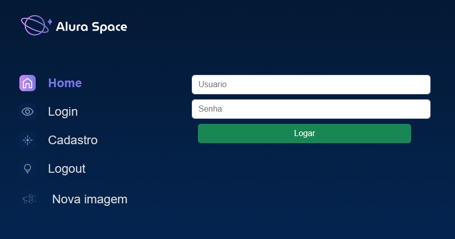
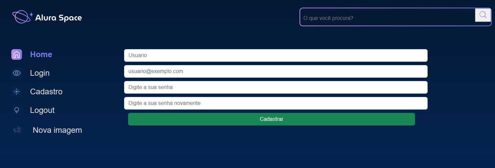
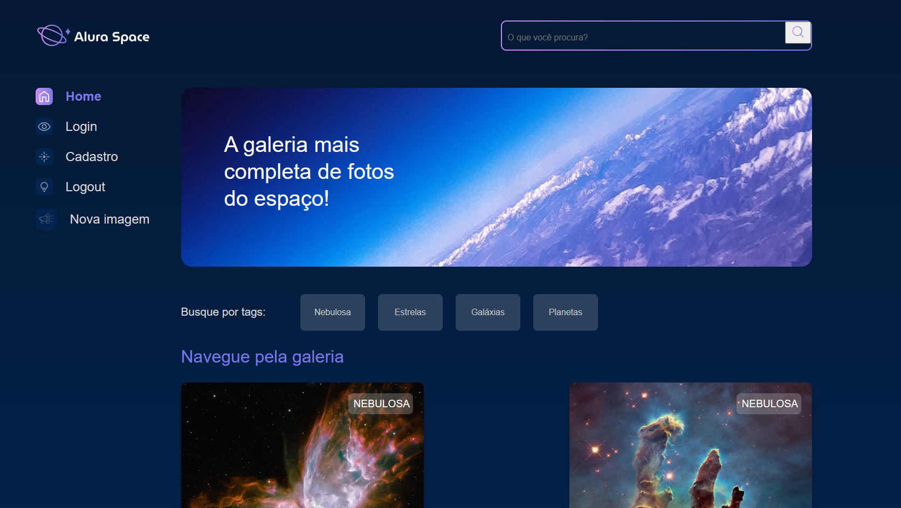
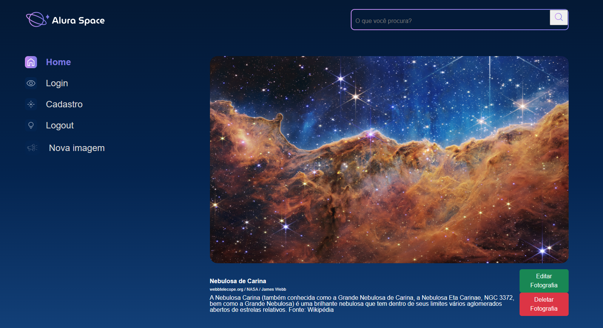

# Alura Space

- Projeto Finalizado

This project is being built alongside the Django Formation: Creating Python Applications, provided by Alura Cursos:
- [x] Django: Templates and Best Practices
- [x] Django: Data Persistence and Admin
- [x] Django: Form Authentication and Alerts
- [x] Django: CRUD and Persistence on S3

## Description
A web application that receives celestial body photos, stores them, and then displays them as a gallery on the website.


## Stack Used

**Front-end:** HTML, CSS, JavaScript

**Back-end:** Python, Django


## Using the Django Web Application

**Prerequisites**
- Make sure you have Python and Django installed on your machine. You can find installation instructions in the official Django documentation.

**Cloning the Repository**
1. Open the terminal and navigate to the directory where you want to clone the project.
2. Run the following command to clone the GitHub repository: `git clone <REPOSITORY_URL>`
This will create a local copy of the project in your directory.

**Setting up the Environment**
1. Navigate to the root directory of the cloned project in the terminal.
2. Create a virtual environment to isolate the project dependencies. Run the following command:`python -m venv myenv`
3. Activate the virtual environment:
- On Windows:
  ```
  myenv\Scripts\activate
  ```
- On Linux/Mac:
  ```
  source myenv/bin/activate
  ```

**Installing Dependencies**
- With the virtual environment activated, install the project dependencies. In the terminal, run the following command: `pip install -r requirements.txt`

**Configuring the Database**
- The project likely uses a database to store information. Check the `settings.py` configuration file to identify which database is being used.
- Make sure you have the database properly configured. You can follow the Django documentation to set up the database according to your choice.

**Running Migrations**
- In the terminal, run the following command to apply the database migrations: `python manage.py migrate`

**Starting the Server**
- Now, you can start the Django development server. In the terminal, run the following command:`python manage.py runserver`

**Accessing the Application**
- Open your browser and access the following URL:`http://localhost:8000/`
- You should see the application running, and you can explore its functionalities.

  
## Screenshots






## License

Todos os direitos reservados a Alura 
